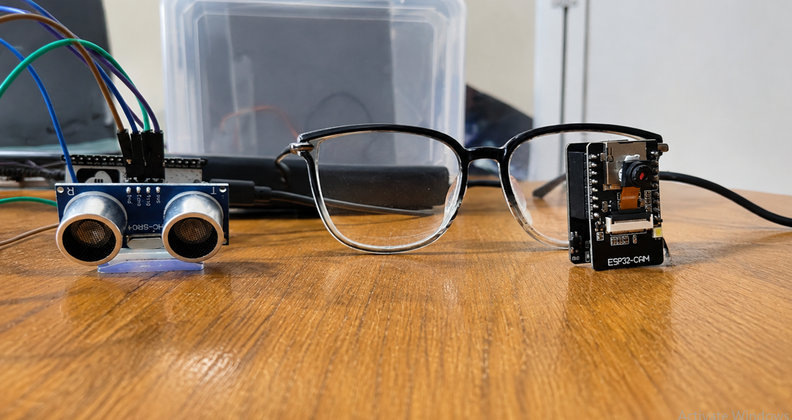

# VisionGuide IoT

VisionGuide is an assistive navigation system for visually impaired users. It combines an Android application, an ESP32-CAM, an ESP32-S3 ultrasonic sensor, and Groq vision AI to detect nearby obstacles and provide immediate spoken guidance.

The Android phone acts as the central hub. It receives distance measurements from the ESP32-S3, requests images from the ESP32-CAM, sends images to a Groq vision model, and reads the resulting instructions aloud.

## About

VisionGuide is designed to improve walking safety by detecting obstacles in front of a user and giving immediate spoken guidance such as:

- "Stop."
- "Bicycle at 11 o'clock. Step right."
- "Path clear ahead. Continue straight."
- "Descending stairs ahead. Stop at edge."

The project is intended for educational, prototype, and assistive-technology development. It should be tested carefully before being used as a primary mobility aid.

### Media & Demonstration

<div style="display: flex; gap: 20px; align-items: flex-start;">
  <div style="flex: 1;">
    
  </div>
  <div style="flex: 1;">
    <video width="100%" height="auto" controls style="border-radius: 8px;">
      <source src="vid2.mp4" type="video/mp4">
      Your browser does not support the video tag.
    </video>
  </div>
</div>

## Features

- Live ESP32-CAM video stream inside the Android app
- ESP32-S3 HC-SR04 ultrasonic distance measurement
- Automatic obstacle triggering below a configurable distance
- Groq vision AI image analysis using a Qwen vision model
- Short navigation instructions optimized for voice output
- Android Text-to-Speech support
- Background monitoring through an Android foreground service
- Live camera, AI, ultrasonic sensor, distance, latency, and event-log status
- Low-latency ESP32-CAM configuration
- Built-in Flask server running inside the Android application
- GitHub Actions workflow for building a debug APK

## System Architecture

```text
+-----------------------+
|  ESP32-S3 + HC-SR04  |
|  Ultrasonic distance  |
+-----------+-----------+
            |
            | POST /distance
            | POST /vision_trigger
            v
+-----------+-----------+
| Android Phone         |
| VisionGuide App       |
|                       |
| Embedded Python/Flask|
| Chaquopy              |
+-----------+-----------+
            |
            | GET /capture
            | GET /status
            v
+-----------+-----------+
| ESP32-CAM             |
| Live camera and image |
+-----------------------+

Android Python server
        |
        | Image + prompt
        v
+-----------------------+
| Groq Vision API       |
| Qwen vision model     |
+-----------------------+

AI instruction
        |
        v
Android Text-to-Speech
```

## How the system works

1. The ESP32-S3 measures distance using the HC-SR04 ultrasonic sensor.
2. Every approximately 1.5 seconds, it sends a heartbeat to the Android phone using:

   ```text
   POST /distance
   ```

3. If an object is detected within the configured trigger distance, normally 30 cm, the ESP32-S3 sends:

   ```text
   POST /vision_trigger
   ```

4. The Python Flask server running inside the Android app requests a fresh image from the ESP32-CAM:

   ```text
   GET http://<CAMERA_IP>/capture
   ```

5. The image is sent to the Groq vision API.
6. The AI returns one short navigation instruction.
7. The Android app displays the instruction and speaks it aloud.
8. The app immediately says "Stop." when a nearby obstacle is detected.

## Repository structure

```text
.
├── app/
│   ├── build.gradle.kts
│   └── src/
│       ├── main/
│       │   ├── java/com/example/
│       │   │   ├── MainActivity.kt
│       │   │   ├── SetupActivity.kt
│       │   │   ├── VisionService.kt
│       │   │   └── ui/theme/
│       │   ├── python/
│       │   │   └── server.py
│       │   ├── assets/
│       │   │   ├── esp32_cam_low_latency.txt
│       │   │   ├── esp32_s3_ultrasonic.txt
│       │   │   ├── hardware_connections.txt
│       │   │   └── server.py
│       │   ├── res/
│       │   │   ├── layout/
│       │   │   ├── drawable/
│       │   │   ├── values/
│       │   │   └── xml/
│       │   └── AndroidManifest.xml
│       ├── test/
│       └── androidTest/
├── .github/workflows/build-apk.yml
├── .env.example
├── build.gradle.kts
├── gradle.properties
├── gradle/libs.versions.toml
├── metadata.json
├── settings.gradle.kts
└── Vision.tsx
```

## Main files

### Android application

- `app/src/main/java/com/example/MainActivity.kt`

  Main user interface. It displays the camera stream, camera status, AI status, ultrasonic status, distance, latency, phone IP address, and event logs.

- `app/src/main/java/com/example/SetupActivity.kt`

  Stores configuration values using Android `SharedPreferences`, including:

  - ESP32-CAM IP address
  - Groq API key
  - Obstacle trigger distance
  - AI cooldown time
  - Camera quality
  - Flask server port

- `app/src/main/java/com/example/VisionService.kt`

  Runs the monitoring process in the background as an Android foreground service. It starts Python through Chaquopy, polls the local Flask server, detects obstacles, and speaks instructions using Text-to-Speech.

### Python server

- `app/src/main/python/server.py`

  The embedded Flask server is responsible for:

  - Monitoring the ESP32-CAM
  - Receiving ultrasonic distance updates
  - Triggering fresh camera captures
  - Sending images to Groq
  - Returning system status
  - Providing a live dashboard
  - Sending obstacle and AI-result callbacks back to Kotlin

### ESP32 firmware

- `app/src/main/assets/esp32_s3_ultrasonic.txt`

  Firmware for the ESP32-S3 and HC-SR04 ultrasonic sensor.

- `app/src/main/assets/esp32_cam_low_latency.txt`

  Firmware for the AI-Thinker ESP32-CAM. It provides:

  - `/status`
  - `/capture`
  - `/control`
  - `/stream`

- `app/src/main/assets/hardware_connections.txt`

  Hardware wiring and power recommendations.

## Technology stack

- Kotlin Android application
- Android SDK
- XML-based Android layouts
- Python 3.11 embedded with Chaquopy
- Flask
- Groq Python SDK
- Qwen vision model through Groq
- ESP32-CAM
- ESP32-S3
- HC-SR04 ultrasonic sensor
- Android Text-to-Speech
- Gradle Kotlin DSL
- GitHub Actions

## Requirements

### Software

- Android Studio
- JDK 17
- Android SDK
- Android device or emulator with Android 8.0/API 26 or higher
- Python 3.11 for Chaquopy builds
- Gradle
- Arduino IDE or PlatformIO for ESP32 firmware
- Groq API key

### Hardware

- Android phone
- AI-Thinker ESP32-CAM with OV2640 camera
- ESP32-S3 development board
- HC-SR04 or HC-SR04P ultrasonic sensor
- Stable 5V power source
- Wi-Fi network or phone hotspot

## Hardware wiring

### HC-SR04 to ESP32-S3

| HC-SR04 pin | ESP32-S3 connection |
|---|---|
| VCC | 5V/VIN |
| GND | GND |
| TRIG | GPIO 5 |
| ECHO | GPIO 19 through a voltage divider |

The HC-SR04 ECHO pin can output 5V, while the ESP32-S3 GPIO is designed for 3.3V logic. Use a voltage divider before connecting ECHO to GPIO 19.

Recommended voltage-divider arrangement:

```text
HC-SR04 ECHO ---- 1kΩ resistor ---- ESP32-S3 GPIO 19
                                      |
                                    2kΩ resistor
                                      |
                                     GND
```

You can also use a 3.3V-compatible HC-SR04P sensor.

### ESP32-CAM power

The ESP32-CAM can draw high current during Wi-Fi transmission. For improved stability:

- Use a 5V power bank or 5V 2A adapter.
- Avoid weak computer USB ports.
- Use short, thick power wires.
- Consider adding a 470µF to 1000µF capacitor between 5V and GND.
- Use the low-latency firmware included in `app/src/main/assets/esp32_cam_low_latency.txt`.

## Network requirements

The following devices must be connected to the same Wi-Fi network or phone hotspot:

1. Android phone
2. ESP32-CAM
3. ESP32-S3

The Android application shows the phone IP address on the main screen. This IP address must be entered into the ESP32-S3 firmware.

Example:

```cpp
const char* PHONE_IP = "192.168.1.100";
```

The ESP32-CAM IP address must be entered in the Android setup screen.

Example:

```text
Camera IP: 192.168.1.120
```

## Configuration

Open the VisionGuide app settings screen and configure:

| Setting | Description | Example |
|---|---|---|
| Camera IP | IP address of the ESP32-CAM | `192.168.1.120` |
| Groq API Key | API key used for vision analysis | `gsk_...` |
| Trigger Distance | Distance at which an obstacle trigger occurs | `30` |
| Cooldown | Minimum delay between AI triggers in milliseconds | `6000` |
| Camera Quality | ESP32-CAM JPEG quality setting | `25` |
| Port | Local Flask server port | `5000` |

Do not commit real API keys to GitHub.

The `.env.example` file contains a placeholder for the Gemini API key, but the current Python implementation uses a Groq API key entered through the application settings screen.

## ESP32-CAM endpoints

The ESP32-CAM firmware exposes these HTTP endpoints:

| Endpoint | Description |
|---|---|
| `GET /status` | Returns camera status and configuration |
| `GET /capture` | Returns one JPEG image |
| `GET /stream` | Returns an MJPEG live stream |
| `GET /control?var=framesize&val=5` | Sets QVGA resolution |
| `GET /control?var=quality&val=25` | Sets JPEG quality |

Example URLs:

```text
http://192.168.1.120/status
http://192.168.1.120/capture
http://192.168.1.120:81/stream
```

## Embedded Flask API

The Flask server runs inside the Android application on port `5000` by default.

### Get system status

```http
GET /status
```

Example response:

```json
{
  "cam_online": true,
  "cam_busy": false,
  "ai": "READY",
  "latency_ms": 840,
  "last_result": "Chair at 12 o'clock. Step right.",
  "distance_cm": "42.5",
  "hc_online": true,
  "event_log": []
}
```

### Send an ultrasonic distance update

```http
POST /distance
Content-Type: application/json

{
  "distance": 75.4
}
```

### Trigger vision processing

```http
POST /vision_trigger
Content-Type: application/json

{
  "distance": 22.1
}
```

This endpoint:

1. Records the obstacle distance.
2. Immediately notifies the Android app.
3. Requests a new image from the ESP32-CAM.
4. Sends the image to Groq vision AI.
5. Returns the generated instruction.

### Send a raw image for analysis

```http
POST /vision
Content-Type: image/jpeg
```

### Open the Flask dashboard

```text
http://<PHONE_IP>:5000/
```

The dashboard shows the camera stream, AI status, ultrasonic status, current distance, latency, and event log.

## Building the Android app

Clone the repository:

```bash
git clone https://github.com/Sanju0845/Visionguide-IOT.git
cd Visionguide-IOT
```

Create the local environment file:

```bash
cp .env.example .env
```

Open the project in Android Studio and allow Gradle to synchronize.

Build the debug APK:

```bash
./gradlew assembleDebug
```

If the Gradle wrapper is not available in your local checkout, use Android Studio's Gradle tools or an installed Gradle version:

```bash
gradle assembleDebug
```

The APK is generated under:

```text
app/build/outputs/apk/debug/
```

The project requires:

- Java 17
- Python 3.11 for Chaquopy
- Android SDK
- Network access for downloading Gradle and Maven dependencies

## Running the app

1. Flash the ESP32-CAM firmware.
2. Record the ESP32-CAM IP address from the serial monitor.
3. Flash the ESP32-S3 ultrasonic firmware.
4. Update `PHONE_IP` in the ESP32-S3 firmware with the Android phone's IP.
5. Connect the phone, ESP32-CAM, and ESP32-S3 to the same network.
6. Install and open the Android application.
7. Enter the camera IP and Groq API key in the setup screen.
8. Set the trigger distance and server port.
9. Start walking only after the camera, AI, and HC sensor indicators become active.

## Low-latency camera settings

The ESP32-CAM firmware is configured for low-latency operation:

```cpp
config.frame_size = FRAMESIZE_QVGA;
config.jpeg_quality = 25;
config.grab_mode = CAMERA_GRAB_LATEST;
WiFi.setSleep(false);
```

These settings reduce image size and prevent old camera frames from building up in the buffer.

The Python server also sends camera control commands when the camera connects:

```text
/control?var=framesize&val=5
/control?var=quality&val=25
```

## GitHub Actions

The repository includes a workflow at:

```text
.github/workflows/build-apk.yml
```

The workflow:

1. Checks out the repository.
2. Installs Java 17.
3. Installs Python 3.11.
4. Creates a debug keystore if required.
5. Creates a local `.env` file from `.env.example`.
6. Builds the debug APK.
7. Uploads the APK as a workflow artifact.

To run it manually, open the GitHub Actions tab and start the **Build Android APK** workflow.

## Security notes

- Never commit a real Groq API key.
- Do not publish Wi-Fi passwords in ESP32 firmware files.
- The Android app currently stores the Groq API key in `SharedPreferences`.
- Consider using Android Keystore or a secure backend for production.
- The app enables cleartext HTTP traffic because the ESP32 devices use local HTTP endpoints.
- Do not expose the Flask server directly to the public internet.
- Use a protected local network or add authentication before deploying outside a private prototype environment.

## Troubleshooting

### Camera is offline

Check:

- ESP32-CAM power supply
- Wi-Fi credentials
- Camera IP address
- Whether the phone and ESP32-CAM are on the same network
- Whether this URL opens:

```text
http://<CAMERA_IP>/status
```

### HC sensor stays offline

Check:

- ESP32-S3 power
- TRIG connection to GPIO 5
- ECHO connection to GPIO 19
- Voltage divider wiring
- `PHONE_IP` in the ESP32-S3 firmware
- Whether the phone firewall blocks port 5000

### AI is not working

Check:

- The Groq API key is valid
- The key is entered in the app settings
- The app has internet access
- The AI status shown by `/status`
- The event log for API errors

### App says "Stop" repeatedly

The app uses a cooldown and obstacle reset threshold. Increase the cooldown value or confirm that the ultrasonic sensor is returning stable distance values.

### ESP32-CAM keeps rebooting

Use a stable 5V power source. Wi-Fi transmission can cause current spikes. A capacitor across 5V and GND can also help reduce brownout resets.

## Project status

VisionGuide is currently an assistive-technology prototype. The main hardware, Android, Python, and AI integration paths are present, but the system should receive additional testing for:

- Outdoor lighting
- Camera failure
- Network disconnection
- AI response accuracy
- False obstacle detection
- Sensor noise
- Battery consumption
- User safety

## License

No license is currently specified for this repository. Add a license before distributing the project or allowing external contributions.
